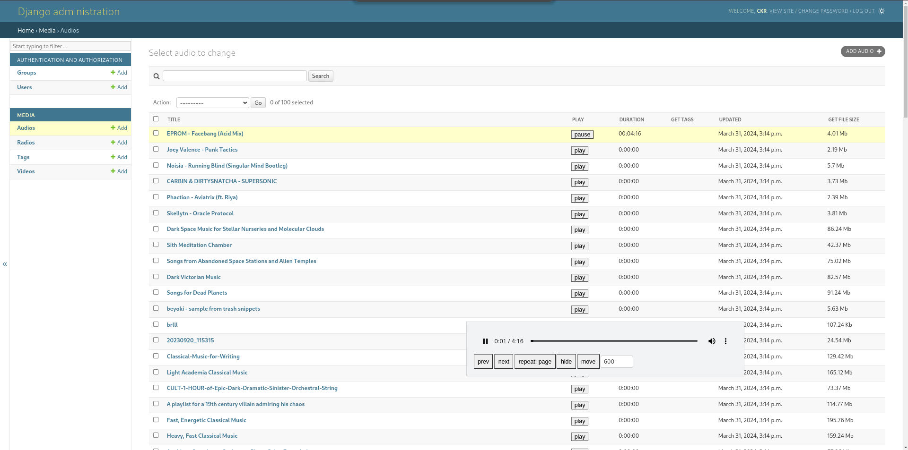
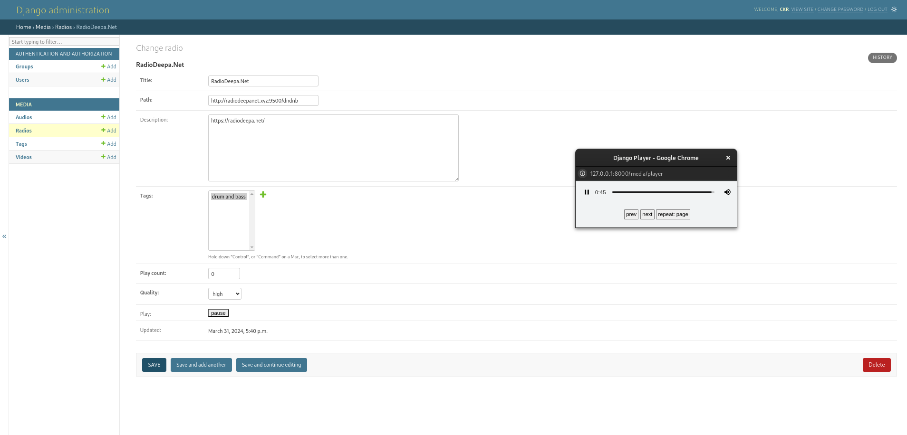
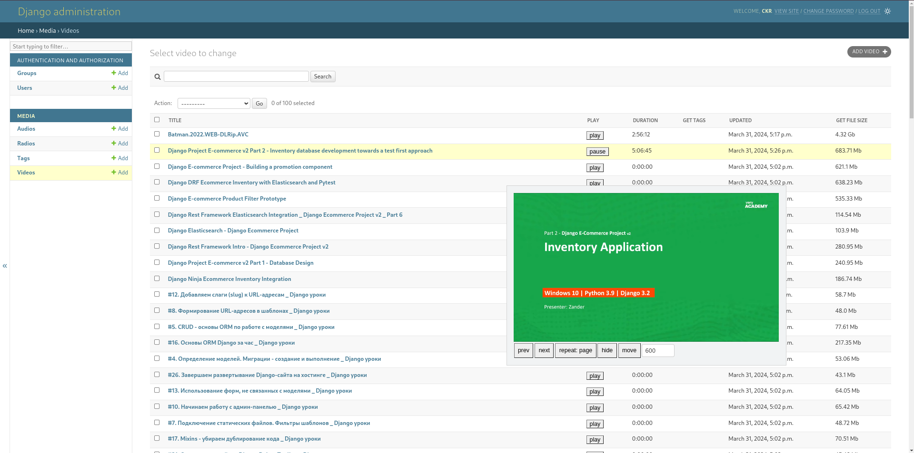
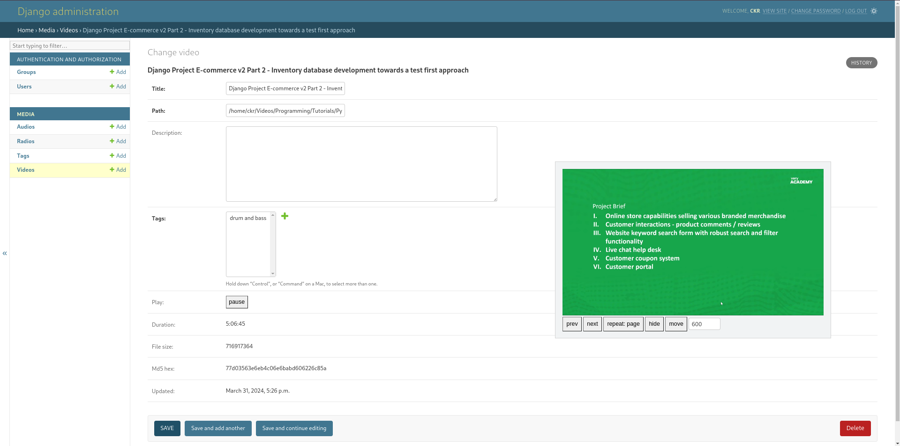

# Django Media Player
Simple django media player implementation with shared web worker and rust actix as stream backend for learning purposes. 
## Example start
Start django.
```
// Start django admin 127.0.0.1:8000
cd media_app
source .venv/bin/activate
./manage.py migrate
./manage.py createsuperuser
./manage.py collectstatic
./manage.py runserver
```
Add media.
```
./manage.py add_media --audio-dir ~/Music --video-dir ~/Videos/ --skip-existing-paths
```
Start stream backend.
```
// Start stream_backend
cd stream_backend
cargo run --release -- 127.0.0.1:8080
```
## Screenshots
### Audio / Radio


### Video


